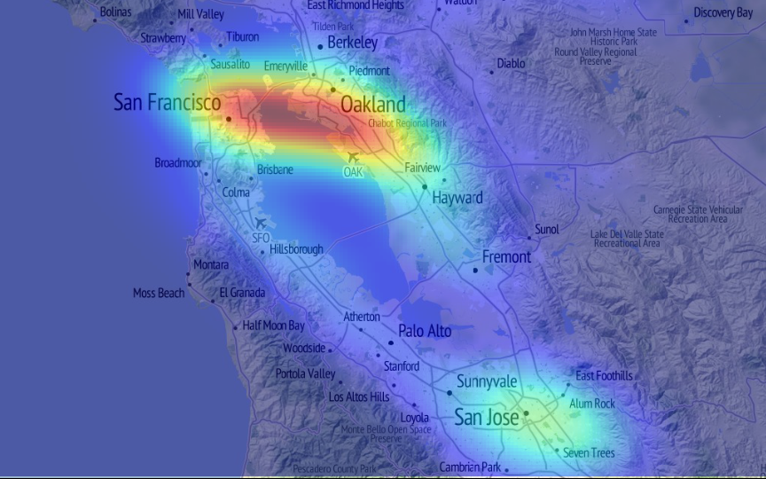
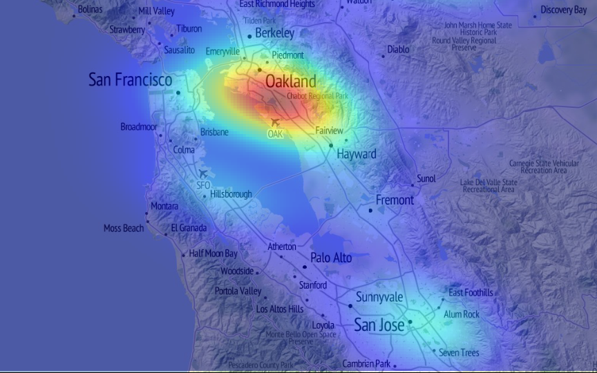

Title: Event Detection
Date: 2014-03-23 12:00
Author: cfarmer
Slug: presentations/scipy2014
Icon: fa-twitter
Status: hidden
Template: full_page

<!-- General and theme style sheets -->
<link rel="stylesheet" href="http://cdnjs.cloudflare.com/ajax/libs/reveal.js/2.6.2/css/reveal.css">
<link rel="stylesheet" href="http://cdnjs.cloudflare.com/ajax/libs/reveal.js/2.6.2/css/theme/simple.css" id="theme">

<!-- For syntax highlighting -->
<link rel="stylesheet" href="http://cdnjs.cloudflare.com/ajax/libs/reveal.js/2.6.2/lib/css/zenburn.css">

<!--[if lt IE 9]>

<![endif]-->

<!-- Get Font-awesome from cdn -->
<!-- <link rel="stylesheet" href="http://netdna.bootstrapcdn.com/font-awesome/3.2.1/css/font-awesome.css"> -->

    </style>

<!-- Custom stylesheet, it must be in the same directory as the html file -->
<link rel="stylesheet" href="../../examples/custom.css">

<section>
    <section>
    

<h1 id="light-weight-real-time-event-detection-with-python">Light-weight real-time event detection with Python</h1>

Carson J. Q. Farmer

<i class="fa fa-twitter fa-fw"></i><a href="http://www.twitter.com/carsonfarmer">@carsonfarmer</a> 
<i class="fa fa-globe fa-fw"></i><a href="http://www.carsonfarmer.com">carsonfarmer.com</a> 
<i class="fa fa-envelope-o fa-fw"></i><a href="mailto:carsonfarmer@gmail.com">carsonfarmer@gmail.com</a> 
<i class="fa fa-github-alt fa-fw"></i><a href="https://github.com/cfarmer">github.com/cfarmer</a>  
<i class="fa fa-briefcase fa-fw"></i><a href="http://www.hunter.cuny.edu/">Hunter College, City University of New York</a> 
<i class="fa fa-map-marker fa-fw"></i><a href="https://www.google.com/maps/place/695+Park+Ave/@40.7687069,-73.9646646,17z/data=!3m1!4b1!4m2!3m1!1s0x89c258ebe705050b:0x22944b98e1be49b7">695 Park Ave, New York, NY, 10065</a>

</section>
    </section><section>
    <section>
    

<h1 id="social-information-sources">Social information sources</h1>

 
 
 
 

    <h2>
        <i class="fa fa-facebook-square fa-4x fa-fw"></i>
        <i class="fa fa-twitter-square fa-4x fa-fw"></i> 
        <i class="fa fa-instagram fa-4x fa-fw"></i>
        <i class="fa fa-flickr fa-4x fa-fw"></i>
    </h2>

<aside class="notes">
    

Real-time feeds of user activity from various apps such as Twitter, Foursquare, and others are becoming increasingly available.

    </aside></section>
    </section><section>
    <section>
    

Source: <a href="http://nmaesthetics.blogspot.com/2011/12/digiself_06.html">Digiself</a>

<aside class="notes">
    

These &#39;digital footprints&#39; provide new means to understand how individuals utilize the places and spaces of urban environments.

    </aside></section>
    </section><section>
    <section>
    

<h1 id="-what-is-going-on-and-when-and-where-is-it-happening"><em>What</em> is going on, and <em>when</em> and <em>where</em> is it happening</h1>

 
 

    <h2>
        <i class="fa fa-question fa-5x fa-fw"></i> 
        <i class="fa fa-clock-o fa-5x fa-fw"></i> 
        <i class="fa fa-map-marker fa-5x fa-fw"></i>
    </h2>

<aside class="notes">
    

The goal of this work is to provide city planners and others with information on <em>what</em> is going on, and <em>when</em> and <em>where</em> it is happening.

    </aside></section>
    </section><section>
    <section>
    

</section>
    </section><section>
    <section>
    

<h1 id="streaming-framework">Streaming framework</h1>

 
 

<h2>
    <i class="fa fa-clock-o fa-5x fa-fw"></i>
    <i class="fa fa-leaf fa-5x fa-fw"></i>
</h2>

<aside class="notes">
    

Traditionally, this type of analysis would require a large investment in heavy-duty computing infrastructure, however, we suggest that a focus on real-time analytics in a lightweight streaming framework is the most logical step forward.

    </aside></section>
    </section><section>
    <section>
    

Source: <a href="http://nmaesthetics.blogspot.com/2011/12/digiself_06.html">Digiself</a>

</section>
    </section><section>
    <section>
    

<h1 id="so-what-are-we-doing-">So what are we doing?</h1>

 
 

    <ul class="fa-ul" style="list-style: none;">
        <li><i class="fa-li fa fa-twitter fa-fw"></i>Stream Twitter data (location-based)</li>
        <li><i class="fa-li fa fa-quote-right fa-fw"></i>Online Latent Semantic Analysis</li>
        <li><i class="fa-li fa fa-th fa-fw"></i>Gridded count of geo-tweets</li>
        <li><i class="fa-li fa fa-cogs fa-fw"></i>Kernel density estimation (KDE)</li>
        <li><i class="fa-li fa fa-bar-chart-o fa-fw"></i>Normalize tweet density</li>
        <li><i class="fa-li fa fa-search fa-fw"></i>Identify high density areas</li>
        <li><i class="fa-li fa fa-globe fa-fw"></i>Feedback results</li>
    </ul>

    <ul style="list-style: none;">
        <li>tweepy</li>
        <li>gensim</li>
        <li>python-geohash</li>
        <li>scipy/numpy (fast_kde.py)</li>
        <li>numpy</li>
        <li>numpy</li>
        <li>pico+leaflet+D3js</li>
    </ul>

<aside class="notes">
    

Using online Latent Semantic Analysis (LSA) from the gensim Python package, we extract &#39;topics&#39; from tweets in an online training fashion. To maintain real-time relevance, the topic model is continually updated, and depending on parameterization, can &#39;forget&#39; past topics. Based on a set of learned topics, a grid of spatially located tweets for each identified topic is generated using standard numpy and scipy.spatial functionality. Using an efficient streaming algorithm for approximating 2D kernel density estimation (KDE), locations with the highest density of tweets on a particular topic are located.

    </aside></section>
    </section><section>
    <section>
    

<h1 id="-i-class-fa-fa-twitter-fa-fw-i-twitter-part-is-easy-http-peter-hoffmann-com-2012-simple-twitter-streaming-api-access-with-python-and-oauth-html-"><i class="fa fa-twitter fa-fw"></i> Twitter part is <a href="http://peter-hoffmann.com/2012/simple-twitter-streaming-api-access-with-python-and-oauth.html">easy</a></h1>
<pre><code class="language-python">import tweepy
import simplejson
import sys

consumer_key = ''
consumer_secret = ''
access_token_key = ''
access_token_secret = ''

auth = tweepy.OAuthHandler(consumer_key, consumer_secret)
auth.set_access_token(access_token_key, access_token_secret)

BOUNDING_BOX = [xmin, ymin, xmax, ymax]

class CustomStreamListener(tweepy.StreamListener):
    def on_status(self, tweet):
        print('Ran on_status')

    def on_error(self, status_code):
        print('Error: ' + repr(status_code))
        return True  # Don't die!

    def on_data(self, data):
        document = simplejson.loads(data)
        # Do something awesome with the tweet info...

sapi = tweepy.streaming.Stream(auth, CustomStreamListener())
sapi.filter(locations=BOUNDING_BOX)
</code></pre>

</section>
    </section><section>
    <section>
    

<h1 id="-i-class-fa-fa-quote-right-fa-fw-i-lsa-part-isn-t-easy-http-radimrehurek-com-gensim-tut1-html-corpus-streaming-one-document-at-a-time-"><i class="fa fa-quote-right fa-fw"></i> LSA part <a href="http://radimrehurek.com/gensim/tut1.html#corpus-streaming-one-document-at-a-time">isn&#39;t easy</a></h1>
<ul>
<li>Latent Semantic Analysis<ul>
<li>Analyzing relationships between a set of documents and the terms they contain by producing a set of concepts related to the documents and terms</li>
<li>Idea is that words that are close in meaning will occur in similar pieces of text</li>
<li>Latent Semantic Indexing (LSI)</li>
</ul>
</li>
<li>Tokenizing (<a href="https://github.com/myleott/ark-twokenize-py"><code>ark-twokenize-py</code></a>), remove common and unique words (<code>stopwords.py</code>)<ul>
<li><a href="http://www.ark.cs.cmu.edu/TweetNLP/">Twitter NLP</a> and Part-of-Speech Tagging</li>
<li><a href="http://snowball.tartarus.org/">Snowball</a> String Processing Language    </li>
</ul>
</li>
<li><a href="http://en.wikipedia.org/wiki/Bag_of_words">Bag-of-words</a>, and/or <a href="http://en.wikipedia.org/wiki/Tf%E2%80%93idf">tf–idf</a> (term frequency–inverse document frequency)</li>
<li>Decay &lt; 1.0 to favor new data trends in input stream</li>
<li>Possibly try Hierarchical Dirichlet Process (because we don&#39;t have to pick # of topics [and gensim has it])</li>
</ul>

   

</section>
    </section><section>
    <section>
    

<h1 id="-i-class-fa-fa-th-fa-fw-i-gridded-topic-counts"><i class="fa fa-th fa-fw"></i> Gridded topic counts</h1>
<ul>
<li>Geohash all coordinates to given scale (optimize for urban environment)<ul>
<li>Convert back to x, y coords (now gridded)</li>
</ul>
</li>
<li>Count unique tweets of given topic<ul>
<li>Normalize counts (by current count and tweet &#39;population&#39;</li>
</ul>
</li>
</ul>

    

<h1 id="-i-class-fa-fa-cogs-fa-fw-i-online-kinda-kde"><i class="fa fa-cogs fa-fw"></i> Online (<em>kinda</em>) KDE</h1>
<ul>
<li>Gaussian kernel density estimate<ul>
<li>Convolution of Gaussian kernel with the 2D histogram</li>
</ul>
</li>
<li>Typically several orders of magnitude faster than <code>scipy.stats.kde.gaussian_kde</code> for large (<code>&gt;1e7</code>) numbers of points<ul>
<li>Can handle ~billion points already without too much trouble...</li>
</ul>
</li>
<li>Streaming framework<ul>
<li>Stream 2D histogram binning process</li>
<li>Run convolution on this when needed</li>
</ul>
</li>
<li>Supports weighted KDE<ul>
<li>Take topic component weights when computing KDE</li>
</ul>
</li>
</ul>

    
</section>
    </section><section>
    <section>
    

<h1 id="-i-class-fa-fa-search-fa-fw-i-identify-events-"><i class="fa fa-search fa-fw"></i> Identify &#39;events&#39;</h1>
<ul>
<li>Locate high-density areas</li>
<li>Right now...<ul>
<li>Let &#39;user&#39; browse current topics &amp; select for viewing</li>
<li>Eventually more automation</li>
</ul>
</li>
<li>Have to get scale right...<ul>
<li>We&#39;re focusing on urban areas (city scale)</li>
</ul>
</li>
</ul>

</section><section>
    

<h2 id="-batkid">#batkid</h2>

</section><section>
    

<h2 id="concert">concert</h2>

</section><section>
    

<h2 id="-drake">#drake</h2>

</section>
    </section><section>
    <section>
    

<h1 id="-i-class-fa-fa-globe-fa-fw-i-feedback-results"><i class="fa fa-globe fa-fw"></i> Feedback results</h1>
<ul>
<li><code>Pico</code> - very small web application framework for <code>Python</code><ul>
<li>Bridge between server side <code>Python</code> and client side <code>Javascript</code></li>
</ul>
</li>
<li><code>Pico</code> is a server, a <code>Python</code> libary and a <code>Javascript</code> library!<ul>
<li>Server is a WSGI application</li>
</ul>
</li>
<li><code>Pico</code> allows you to <a href="https://github.com/fergalwalsh/pico/wiki/Streaming-functions">stream</a> data from <code>Python</code> to <code>Javascript</code><ul>
<li>Simply write your function as a <code>Python</code> generator!</li>
</ul>
</li>
</ul>

</section><section>
    

<h2 id="write-a-python-module">Write a Python module</h2>
<pre><code class="language-python"># example.py
import pico

def hello(name="World"):
    return "Hello " + name
</code></pre>
<h2 id="start-the-server">Start the server</h2>
<pre><code class="language-bash">python -m pico.server
</code></pre>

</section><section>
    

<h2 id="call-your-python-functions-from-javascript">Call your Python functions from Javascript</h2>
<pre><code class="language-html">&lt;!DOCTYPE HTML&gt;
&lt;html&gt;
&lt;head&gt;
  &lt;title&gt;Pico Example&lt;/title&gt;
    &lt;script src="/pico/client.js"&gt;&lt;/script&gt;
    &lt;script&gt;
        pico.load("example");
    &lt;/script&gt;
&lt;/head&gt;
&lt;body&gt;
  &lt;p id="message"&gt;&lt;/p&gt;
  &lt;script&gt;
  example.hello("Fergal", function(response){
    document.getElementById('message').innerHTML = response;  
  });
  &lt;/script&gt;
&lt;/body&gt;
&lt;/html&gt;
</code></pre>

</section><section>
    

<h2 id="want-that-to-stream-">Want that to stream?</h2>
<pre><code class="language-python">import pico
import gevent

@pico.stream
def stream():
   for line in open('long_file.txt'):
      yield line
      gevent.sleep(0.1)
</code></pre>

(Plus some other <a href="https://github.com/surfly/gevent"><code>gevent</code></a> magic)

<h2 id="-normal-call-from-javascript">&#39;Normal&#39; call from Javascript</h2>
<pre><code class="language-javascript">example.stream(function(line){
   console.log(line)
})
</code></pre>

</section>
    </section><section>
    <section>
    

<h1 id="where-are-we-at-now-">Where are we at now?</h1>
<ul>
<li>Code and &#39;science&#39; <em>works</em> for the most part<ul>
<li>Nowhere near &#39;production&#39; ready</li>
</ul>
</li>
<li>Web-framework is non-existant (but getting ready)<ul>
<li>My collaborator (<code>pico</code> author) just got a &#39;real-job&#39; and got married</li>
</ul>
</li>
<li>Very happy with how lightweight and &#39;easy&#39; this is to setup<ul>
<li>You can pretty much just drop <code>anaconda</code> or similar on a server and this will work</li>
</ul>
</li>
</ul>

</section>
    </section><section>
    <section>
    

<h1 id="what-did-we-learn-">What did we learn?</h1>
<ul>
<li>Twitter had the x and y coordinates reversed for a while :-p</li>
<li>People talk about themselves <em>a lot</em>!<ul>
<li>Most tweets <em>at least</em> contain <code>i&#39;m</code>, <code>my</code>, <code>me</code>, etc...</li>
<li>Stopwords and good tokenizing are important!</li>
</ul>
</li>
<li>English language is often ambiguous<ul>
<li>(i.e., this stuff is hard)</li>
</ul>
</li>
<li>Geography <em>is</em> still important<ul>
<li>Many tweets have spatial component and twitter trends <em>do</em> vary geographically</li>
</ul>
</li>
</ul>

</section><section>
    

<h2 id="-batkid-versus-everything">#batkid versus everything</h2>

</section>
    </section><section>
    <section>
    

<h1 id="light-weight-real-time-event-detection-with-python">Light-weight real-time event detection with Python</h1>

Carson J. Q. Farmer

<i class="fa fa-twitter fa-fw"></i><a href="http://www.twitter.com/carsonfarmer">@carsonfarmer</a> 
<i class="fa fa-globe fa-fw"></i><a href="http://www.carsonfarmer.com">carsonfarmer.com</a> 
<i class="fa fa-envelope-o fa-fw"></i><a href="mailto:carsonfarmer@gmail.com">carsonfarmer@gmail.com</a> 
<i class="fa fa-github-alt fa-fw"></i><a href="https://github.com/cfarmer">github.com/cfarmer</a>  
<i class="fa fa-briefcase fa-fw"></i><a href="http://www.hunter.cuny.edu/">Hunter College, City University of New York</a> 
<i class="fa fa-map-marker fa-fw"></i><a href="https://www.google.com/maps/place/695+Park+Ave/@40.7687069,-73.9646646,17z/data=!3m1!4b1!4m2!3m1!1s0x89c258ebe705050b:0x22944b98e1be49b7">695 Park Ave, New York, NY, 10065</a>

</section>
    </section>

<!--  -->

